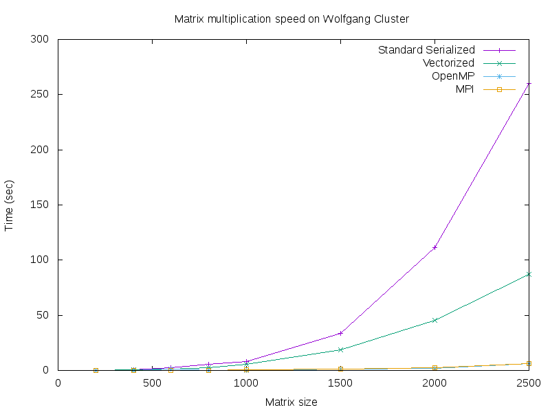

# Models of Parallel Computing

## Overview
1. SIMD - Single instruction multiple data 
    SIMD involves performing the same operation on multiple data streams, achieving data level parallelism.

2. Symmetric Multiprocessing
    * Multiple threads share common memory and I/O resources, performing different instructions. Code sections with OMP marks will be run with multiple threads.
    * Tool: OpenMP - a language extension compatible with FORTRAN and C/C++

3. Distributed Parallel Computing
    * Having independent computers linked via a high speed network (or cluster). Sending and receiving messages along with tags and ranks can differentiate contents and processes respectively
    * Tool: MPI - a library specification for message-passing. 

## Full project life cycle

Trello board: https://trello.com/b/mKflgSQr/lab-6-parrallel-computing

1. Week 1

    Execution of MPI HelloWorld code are performed, and we looked at writing the vectorized version of matrix mutiplication. Concepts of vectorized memory was reviewd and actual code wa implemented after. 

    We first looked into the provided code base to understand its structure, starting with "mat.h" and Makefile. After getting the gist of the code, we decided to split into 2 branches to finally deliver 2 versions of the implementation and compare instead of having all three people working on one.

    Set up the work flow from building local implementations, uploading to gitHub and compiling and testing on Wolfgand cluster. VSCode was intensively used.
    Testing for full project was carried out using function ***compare_matrices(c_actual, c_calc, MAT_SIZE, MAT_SIZE);***

2. Week 2

    We have now studied the relationship in time efficiency of Serialized, SIMD, and OpenMP algorithms. This week we focused on adding OpenMP results. We have supplied multiple text files containing square matrices, whose dimensions are specified on the first line of the file, in format **rows(n) cols(m)**. 

    When compiling this project, you can see the comparison between the different types of algorithms we have studied so far by typing: **./mmult_omp_timing a b**, where a and b are txt files in the repository of matching dimensions. 

    We have also generated a graph, using gnuplot, that visualizes the different in time efficiency of each algorithm. That graph is included in the repository and is titled **SIMD_vs_Symmetric_vs_OMP.png**

    We have found this week that OpenMP is significantly faster than SIMD, which is significantly faster than serialized. When multiplying square matrices of size 2500, serialized took about 55 seconds, SIMD took about 16 seconds, and OpenMP took about 3 seconds.

3. Week 3

    We implemented the MPI and MPI/OMP model and tested with various NxN matrix with N ranging from 100 to 10000. A graph displaying the computation speed between the 2 models are generated. We could not produce a graph of all the models since SIMD is unable to compute matrix of larger sizes in a reasonable amount of time. so 2 graphs displaying the results are produced with gnuplot as be low.

    

    ***Figure 1: SIMD_vs_SIMDVectorized_vs_OMP***

    

    ***Figure 2: MPI_vs_MPI/OMP***

## Results

 With the graphs produced, we can conclude SIMD < SIMD Vectorize < Symmetric Multiprocessing w OpenMP ~  Distributed Parallel Computing w MPI

## Team work

* Khai Nguyen
    - setup and test out MPI HelloWorld project. Build the Trello project board and update whenver a new checkpoint is met.
    - review and implement the MPI matrix multiplication
    - implement the MPI matrix multiplication
    - setup the automation pipeline for gnuplot graphing
    - validity of results for matrix multiplication
    - fix and debug memory allocation happend uring MPI implementation
    - update README

* John Murray
    - random matrix generation, performed through open-source websites online
    - build the implementation for OpenMP matrix multiplication
    - generate graphs using gnuplot to compare SIMD & OpenMP
    - build the implementation for taking in matrix from files
    - automate matrix generation by building a batch file
    - writing README

* An Nguyen 
    - validity of results for matrix multiplication
    - implement vectorized matrix multiplication
    - testing and proofreading all new added code 
    - writing README

## Contribution

    * Khai Nguyen - khai@emple.edu
    * John Murray - johnmurray@temple.edu
    * An Nguyen  - an.nguyen0002@temple.edu